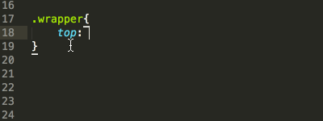

CSSREM
-------------

一个CSS的px值转rem值的Sublime Text 3自动完成插件。

插件效果如下：

##### 安装

* 下载本项目，比如：git clone https://github.com/flashlizi/cssrem
* 进入packages目录：Sublime Text -> Preferences -> Browse Packages...
* 复制下载的cssrem目录到刚才的packges目录里。
* 重启Sublime Text。

##### 配置参数

参数配置文件：Sublime Text -> Preferences -> Package Settings -> cssrem

* `px_to_rem` - px转rem的单位比例，默认为40。
* `max_rem_fraction_length` - px转rem的小数部分的最大长度。默认为6。
* `available_file_types` - 启用此插件的文件类型。默认为：[".css", ".less", ".sass"]。